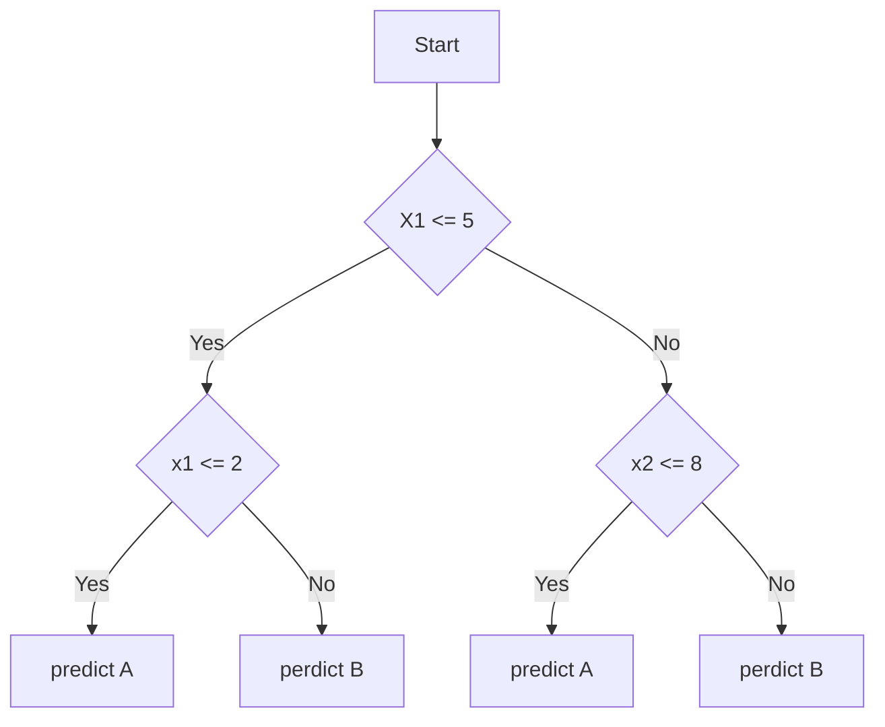

file 2 con link a [[file3]]


```python
def code():
	heres_some(code)
	#written in python
```


```mermaid
graph TD

A[Start] --> B{X1 <= 5}

B -->|Yes| C{x1 <= 2}

B -->|No| D{x2 <= 8}

C -->|Yes| E[predict A]

C -->|No| F[perdict B]

D -->|Yes| G[predict A]

D -->|No| H[perdict B]
```
